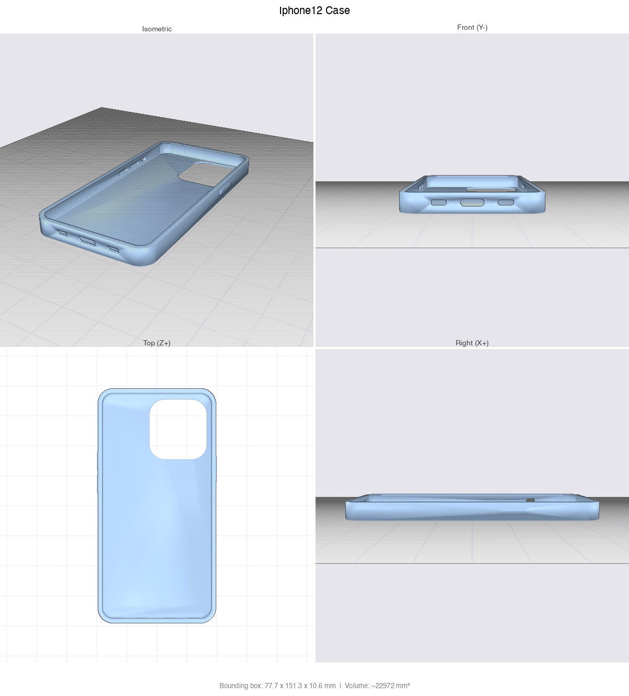

# CAD Skill for Claude Code

A [Claude Code](https://docs.anthropic.com/en/docs/claude-code) skill for generating parametric 3D-printable models using [CadQuery](https://cadquery.readthedocs.io/). Describe a physical object, and Claude will write a parametric script, export STL, render previews, and iterate with you until it's right.

<p align="center">
  
  
</p>

Read the full write-up: [I Taught Claude to Design 3D-Printable Parts. Here's How](https://medium.com/TODO)

## Installation

```bash
mkdir -p ~/.claude/skills
git clone https://github.com/flowful-ai/cad-skill ~/.claude/skills/parametric-3d-printing
```

## Dependencies

Requires **Python 3.10-3.12** (CadQuery's OCC kernel does not have wheels for 3.13+):

```bash
python3.12 -m venv .venv && source .venv/bin/activate
pip install cadquery trimesh pyrender Pillow
```

## Files

| File | Purpose |
|------|---------|
| `SKILL.md` | Skill definition and workflow instructions for Claude |
| `preview.py` | Headless STL to multi-view PNG renderer (trimesh + pyrender) |
| `design-review.md` | Visual inspection checklist and printability analysis |

---

Created by [Nicolas Chourrout](https://flowful.ai) from [Flowful.ai](https://flowful.ai)
